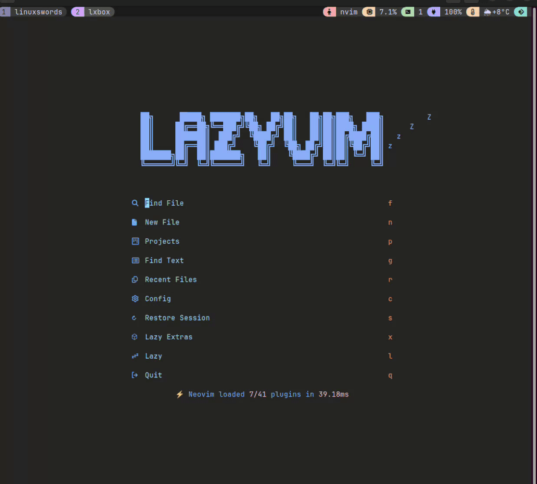

# nvim-chess

[](https://github.com/linuxswords/nvim-chess/actions/workflows/test.yml)

## Demo



A Neovim plugin for playing chess on Lichess.org directly from your editor.

## Features

- 🧩 Solve chess puzzles (daily puzzles and training) on lichess.org
- 🎨 Text-based chess board with Unicode or ASCII pieces
- 👤 Profile and rating information
- ✅ Move validation and UCI notation
- 🔄 Auto-refresh and flip board functionality

## Requirements

- Neovim 0.7+
- [plenary.nvim](https://github.com/nvim-lua/plenary.nvim)
- Lichess.org account and personal access token

## Installation

### Using [packer.nvim](https://github.com/wbthomason/packer.nvim)

```lua
use {
  'linuxswords/nvim-chess',
  requires = { 'nvim-lua/plenary.nvim' }
}
```

### Using [lazy.nvim](https://github.com/folke/lazy.nvim)

```lua
{
  'linuxswords/nvim-chess',
  dependencies = { 'nvim-lua/plenary.nvim' }
}
```

## Configuration

### Getting a Lichess Token

1. Go to [https://lichess.org/account/oauth/token](https://lichess.org/account/oauth/token)
2. Create a new personal access token
3. Select appropriate scopes (recommend: `board:play`, `challenge:read`, `challenge:write`, `puzzle:read`)

### Authentication

You can authenticate in multiple ways:

#### Option 1: Setup Configuration (Recommended for persistent auth)

Configure your token once in your Neovim config, then use `:ChessAuthenticate` to activate:

```lua
require('nvim-chess').setup({
  lichess = {
    token = "your_lichess_token_here",  -- Your Lichess personal access token
    timeout = 30000,                   -- Request timeout in milliseconds
  },
  ui = {
    board_style = "unicode",           -- "unicode" or "ascii" pieces
    auto_refresh = true,               -- Auto-refresh board on updates
    show_coordinates = true,           -- Show board coordinates (a-h, 1-8)
    highlight_last_move = true,        -- Highlight the last move made
    puzzle_window_mode = "reuse",      -- "reuse" to replace current buffer, "split" to always create new window
  }
})
```

Then validate and activate:

```vim
:ChessAuthenticate
" Uses your configured token automatically and validates it
```

#### Option 2: Interactive Command (No config needed)

```vim
:ChessAuthenticate
" Prompts for token if none configured
```

#### Option 3: Direct Token (One-time use)

```vim
:ChessAuthenticate your_token_here
" Uses provided token, overrides config
```

### Authentication Commands

| Command                      | Description                                                                                |
| ---------------------------- | ------------------------------------------------------------------------------------------ |
| `:ChessAuthenticate [token]` | Authenticate with Lichess (uses configured token, prompts if none, or uses provided token) |
| `:ChessStatus`               | Show current authentication status                                                         |
| `:ChessLogout`               | Logout from Lichess                                                                        |

**How `:ChessAuthenticate` works:**

1. If you provide a token: Uses that token
2. If token configured in setup: Uses configured token
3. Otherwise: Prompts you to enter token

## Usage

When viewing a chess board, use these keys:

- `m` - Enter a move
- `f` - Flip board orientation
- `R` - Resign game
- `A` - Abort game
- `q` - Close board
- `<C-r>` - Refresh board

### Move Notation

Use UCI (Universal Chess Interface) notation for moves:

- `e2e4` - Move piece from e2 to e4
- `a7a8q` - Promote pawn to queen
- `e1g1` - Castling (king side)

## Puzzle Solving

### Puzzle Window Display Mode

You can configure how puzzles are displayed when opened:

- **`reuse`** (default): Replaces the current buffer with the puzzle. Useful for keeping your window layout clean.
- **`split`**: Always creates a new split window for each puzzle. Useful if you want to keep your current buffer visible.

Set this in your configuration:

```lua
require('nvim-chess').setup({
  ui = {
    puzzle_window_mode = "reuse",  -- or "split"
  }
})
```

### Getting Started with Puzzles

1. **Solve the daily puzzle** (no authentication required):

   ```vim
   :ChessDailyPuzzle
   ```

2. **Train with puzzles** (works without auth, better with it):

   ```vim
   :ChessNextPuzzle
   ```

   _Without authentication: Random puzzles_
   _With authentication: Rating-matched puzzles_

   To get rating-matched puzzles, authenticate first:

   ```vim
   :ChessAuthenticate
   ```

3. **Load a specific puzzle**:

   ```vim
   :ChessGetPuzzle abc12345
   ```

### Puzzle Controls

When viewing a puzzle, use these keys:

- `m` - Make a move (enter move in UCI notation)
- `h` - Show hint (displays the starting and ending square)
- `s` - Show full solution
- `n` - Get next puzzle
- `q` - Close puzzle
- `<C-r>` - Refresh puzzle display

### How Puzzles Work

- Puzzles present a position where you need to find the best move(s)
- The board automatically flips to show the position from the side to move
- Enter moves in UCI notation (e.g., `e2e4`)
- If you make the correct move, the opponent's response is played automatically
- Continue until you've solved the entire puzzle or make a wrong move
- Puzzle ratings and themes are displayed to help you learn

## Commands

### Puzzle Commands

| Command                | Description                                          |
| ---------------------- | ---------------------------------------------------- |
| `:ChessDailyPuzzle`    | Solve today's daily puzzle                           |
| `:ChessNextPuzzle`     | Get next puzzle (random or rating-matched with auth) |
| `:ChessGetPuzzle {id}` | Load a specific puzzle by ID                         |
| `:ChessPuzzleActivity` | View puzzle history (auth required)                  |

### Authentication Commands

| Command                      | Description                                     |
| ---------------------------- | ----------------------------------------------- |
| `:ChessAuthenticate [token]` | Authenticate with Lichess (prompts if no token) |
| `:ChessStatus`               | Show current authentication status              |
| `:ChessLogout`               | Logout from Lichess                             |

### Version Commands

| Command         | Description                      |
| --------------- | -------------------------------- |
| `:ChessVersion` | Show plugin version              |
| `:ChessInfo`    | Show detailed plugin information |

## Board Display

The plugin displays chess boards using either Unicode or ASCII pieces:

### Unicode Style

```
  a b c d e f g h
8 ♜ ♞ ♝ ♛ ♚ ♝ ♞ ♜  8
7 ♟ ♟ ♟ ♟ ♟ ♟ ♟ ♟  7
6 · · · · · · · ·  6
5 · · · · · · · ·  5
4 · · · · · · · ·  4
3 · · · · · · · ·  3
2 ♙ ♙ ♙ ♙ ♙ ♙ ♙ ♙  2
1 ♖ ♘ ♗ ♕ ♔ ♗ ♘ ♖  1
  a b c d e f g h
```

### ASCII Style

```
  a b c d e f g h
8 r n b q k b n r  8
7 p p p p p p p p  7
6 . . . . . . . .  6
5 . . . . . . . .  5
4 . . . . . . . .  4
3 . . . . . . . .  3
2 P P P P P P P P  2
1 R N B Q K B N R  1
  a b c d e f g h
```

## Architecture

The plugin is structured with these main modules:

- `lua/nvim-chess/` - Core plugin logic
  - `init.lua` - Main plugin interface
  - `config.lua` - Configuration management
  - `api/` - Lichess API communication
  - `ui/` - Chess board rendering
  - `game/` - Game state management
  - `auth/` - Authentication handling
  - `utils/` - Utility functions

## License

This project is licensed under the MIT License - see the [LICENSE](LICENSE) file for details.

## Contributing

Contributions welcome! Please read the contributing guidelines and submit pull requests.

## Local Testing

You can test the plugin functionality without a Lichess account using the built-in mock system:

### Quick Testing

```bash

# Run unit and demo tests
make test

# Run just unit tests
make test-unit

# Run integration tests (requires LICHESS_TOKEN)
export LICHESS_TOKEN=your_token_here
make test-integration

# Run all tests including integration
make test-all

## Support
```

- File issues on GitHub
- Check the documentation with `:help nvim-chess`
- Ensure you have a valid Lichess token configured for real gameplay
